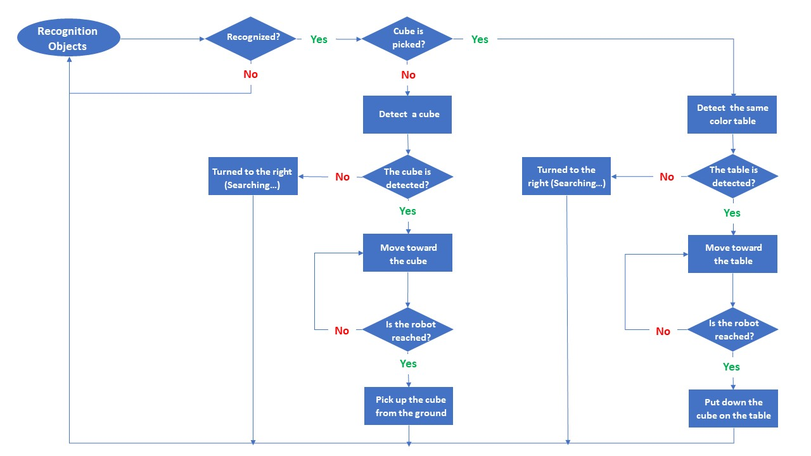

# KUKA youBot - Color Recognition and Object Placement System

[](https://cyberbotics.com/)
[](https://www.python.org/)
[](LICENSE)

An autonomous robotics project implementing color-based object recognition and manipulation using the KUKA youBot mobile manipulator in Webots simulation environment. The robot autonomously identifies colored boxes, picks them up, and places them on correspondingly colored tables.



## 📋 Table of Contents

- [Overview](#overview)
- [Features](#features)
- [Prerequisites](#prerequisites)
- [Installation](#installation)
- [Usage](#usage)
- [Project Structure](#project-structure)
- [Documentation](#documentation)
- [Technical Details](#technical-details)
- [System Architecture](#system-architecture)
- [Demo](#demo)
- [Technologies Used](#technologies-used)
- [Author](#author)
- [License](#license)

## 🎯 Overview

This project demonstrates an autonomous robotic system capable of:
- **Color Recognition**: Identifying objects by their color (Red, Green, Blue)
- **Object Classification**: Distinguishing between boxes (cubes) and tables
- **Autonomous Navigation**: Moving toward detected objects with visual servoing
- **Manipulation**: Picking up boxes and placing them on matching colored tables
- **Task Execution**: Continuously searching and organizing objects until all boxes are placed

The strategic workflow involves the robot initially surveying the environment via camera-based color recognition to identify objects. Subsequently, the robot distinguishes between tables and boxes (cubes) and recognizes their respective colors. After identifying an object and determining its nature, the robot selects a specific box (e.g., a red one), tracks it, moves toward it, and picks it up. This process repeats as the robot searches for an appropriate matching table (e.g., a red table). Once located, the robot places the box on the table, resumes searching for other boxes, and positions them on their designated tables.


## ✨ Features

- **Real-time Color Recognition**: Camera-based object detection with RGB color classification
- **Intelligent Object Classification**: Automatic distinction between boxes and tables
- **Visual Servoing**: Position-based navigation using camera feedback
- **Precise Manipulation**: 5-DOF arm control with orientation compensation
- **Autonomous Operation**: Complete task execution without human intervention
- **Omnidirectional Movement**: Holonomic base with 4-wheel differential drive

## 🔧 Prerequisites

Before running this project, ensure you have the following installed:

- **Webots R2023b or later** - [Download here](https://cyberbotics.com/)
- **Python 3.7+** - [Download here](https://www.python.org/downloads/)
- **KUKA youBot Robot Model** (included in Webots)

### System Requirements

- Operating System: Windows, macOS, or Linux
- RAM: Minimum 4GB (8GB recommended)
- Graphics: OpenGL 3.3+ compatible graphics card

## 📦 Installation

1. **Clone the repository**
   ```bash
   git clone https://github.com/Siavash-Mortaz/KUKA-youBot.git
   cd KUKA-youBot
   ```

2. **Install Webots**
   - Download and install Webots from the [official website](https://cyberbotics.com/)
   - Follow the installation instructions for your operating system

3. **Configure Webots Python Controller**
   - Ensure Webots is properly configured to use Python
   - The controller uses the built-in `controller` module from Webots

4. **Set up the World File**
   - Open your Webots world file containing the KUKA youBot
   - Ensure the robot has a camera device named `'camera'` attached to the `bodySlot`
   - Configure the camera's `recognitionColors` parameter for color detection

## 🚀 Usage

1. **Open Webots**
   ```bash
   webots
   ```

2. **Load the World File**
   - Open your world file containing the KUKA youBot and the environment with colored boxes and tables

3. **Set the Controller**
   - In the robot's controller field, set it to `my_controller.py` (or point to `codes/my_controller.py`)

4. **Run the Simulation**
   - Click the play button or press `Ctrl+Shift+P` to start the simulation
   - The robot will autonomously begin searching for objects

5. **Monitor the Execution**
   - Watch the console output for status messages
   - Observe the robot's behavior in the 3D simulation window

### Camera Configuration

The camera is integrated into the robot's `bodySlot`, positioned strategically below the KUKA logo. The camera features color recognition parameters in the `recognitionColors` section, enabling real-time object detection and classification.


## 📁 Project Structure

```
KUKA-youBot/
│
├── codes/
│   └── my_controller.py      # Main robot controller implementation
│
├── docs/
│   └── [Cognitive Systems and Robotics-Siavash Mortaz Hejri.pdf](docs/Cognitive%20Systems%20and%20Robotics-Siavash%20Mortaz%20Hejri.pdf)
│
├── images/
│   ├── Camera.jpg            # Camera setup visualization
│   ├── Environment.jpg        # Simulation environment
│   ├── Logic Chart.jpg        # System workflow diagram
│   └── Rec.gif               # Demonstration animation
│
└── README.md                  # Project documentation
```

## 📚 Documentation

For detailed project documentation, including methodology, implementation details, and theoretical background, please refer to the project report:

📄 **[Download Project Report PDF](docs/report.pdf)**

The report covers:
- Project objectives and scope
- System design and architecture
- Implementation methodology
- Algorithm descriptions
- Results and analysis
- Future improvements

## 🔬 Technical Details

### Robot Configuration

- **Base**: 4-wheel omnidirectional mobile base
- **Manipulator**: 5-DOF articulated arm
- **End Effector**: 2-finger gripper
- **Sensors**: 
  - Camera with color recognition
  - 5 arm position sensors

### Control Parameters

- **Timestep**: 64ms
- **Max Speed**: 3.0 rad/s (base motors)
- **Arm Velocities**: 
  - Arm 1: 0.2 rad/s
  - Arm 2: 0.5 rad/s
  - Arm 3: 0.5 rad/s
  - Arm 4: 0.3 rad/s
- **Gripper Velocity**: 0.03 rad/s

### Color Detection System

The system recognizes three primary colors:
- **Red**: RGB(1, 0, 0) for boxes, RGB(0.5, 0, 0) for tables
- **Green**: RGB(0, 1, 0) for boxes, RGB(0, 0.5, 0) for tables
- **Blue**: RGB(0, 0, 1) for boxes, RGB(0, 0, 0.5) for tables

### Navigation Algorithm

1. **Object Detection**: Continuously scan environment using camera
2. **Centering**: Rotate to center object in camera frame
3. **Approach**: Move forward when object is centered
4. **Threshold Check**: Stop when within 0.15m (boxes) or 0.2m (tables)

## 🏗️ System Architecture

### Main Control Loop

The system operates in two primary states:

1. **Search and Pick State** (`pickFlag = 0`)
   - Detect boxes in the environment
   - Navigate to detected box
   - Pick up the box
   - Transition to placement state

2. **Search and Place State** (`pickFlag = 1`)
   - Detect matching colored table
   - Navigate to table
   - Place box on table
   - Return to search state

### Key Functions

- `move_forward()`: Base forward movement
- `move_left()` / `move_right()`: Rotational movement
- `strafe_left()` / `strafe_right()`: Lateral movement
- `move_to_object()`: Visual servoing to object
- `detect_boxes()`: Box detection and color identification
- `detect_tables()`: Table detection with color matching
- `pick_up_object()`: Arm trajectory for picking
- `put_down_object()`: Arm trajectory for placing

### Workflow Diagram


## 🎬 Demo


Watch the robot in action as it autonomously identifies, picks up, and organizes colored boxes onto their corresponding tables.

## 🛠️ Technologies Used

- **Webots**: 3D robot simulator by Cyberbotics Ltd.
  - Free and open-source
  - Widely used in industry, education, and research
  - Realistic physics simulation
  - Multi-robot support

- **Python**: Programming language for robot controller
  - Webots Python API
  - Object-oriented design
  - Real-time control loops

- **KUKA youBot**: Mobile manipulator platform
  - Omnidirectional base
  - 5-DOF articulated arm
  - Integrated gripper system

## 👤 Author

**Siavash Mortaz Hejri**

- GitHub: [@Siavash-Mortaz](https://github.com/Siavash-Mortaz)
- Project: [KUKA-youBot](https://github.com/Siavash-Mortaz/KUKA-youBot)

This project was developed as part of the **Cognitive Systems and Robotics** course for the **MSc in Artificial Intelligence** program at **Sheffield Hallam University**.

## 📄 License

This project is licensed under the MIT License - see the LICENSE file for details.

## 🙏 Acknowledgments

- **Dr. Samuele Vinanzi** - Course instructor for Cognitive Systems and Robotics at Sheffield Hallam University
- **Sheffield Hallam University** - For providing the academic framework and resources
- **Cyberbotics Ltd.** - For providing the Webots simulation platform
- **KUKA Robotics** - For the youBot platform design

---

**Note**: This project is designed for educational and research purposes. For production use, additional safety measures and error handling should be implemented.
